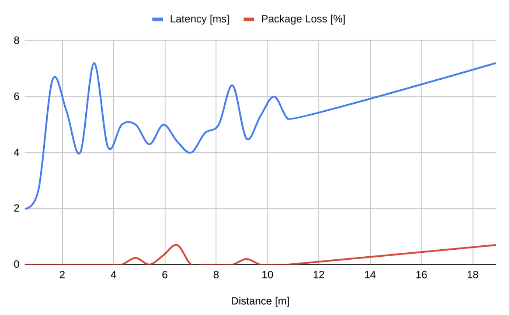

# Design of a Multi-Purpose Remote Controlled Underwater Vehicle Using ROS/#2 Unity and MATLAB 

https://github.com/memrecakal/Design-of-a-Multi-Purpose-Remote-Controlled-Underwater-Vehicle-Using-ROS-2-Unity-and-MATLAB-/assets/42466646/00838582-3a07-49c0-bce5-dc4a329a61b3

## Table of Contents  
1. [Introduction](#Introduction)
2. [Communication Framework](#Communication-Framework)
    - [Simulated Scheme: Complete Unity & ROS & MATLAB Control Integration](#simulated-scheme-complete-unity--ros--matlab-control-integration)
      * [Unity + ROS#: Physics & Plant Implementation](#unity--ros-physics--plant-implementation)
      * [MATLAB + ROS2: Control Integration](#matlab--ros2-control-integration)
    - [Application Scheme](#Application-Scheme)
3. [Hardware](#Hardware)
    - [Networking](#Networking)
      * [Android Control Panel](#Android-Control-Panel)
      * [Raspberry Pi & ESP32](#Raspberry-Pi--ESP32)
      * [Latency Analysis](#Latency-Analysis)
    - [Actuators](#Actuators)
    - [Sensors](#sensors)
    - [Overall Electronics Scheme](#Overall-Electronics-Scheme)
4. [Dynamics & Control](#Dynamics--Control)
5. [Design](#design)
6. [CFD Analysis](#CFD-Analysis)
7. [Manufacturing](#manufacturing)

## Introduction

The project aims to create a versatile remote-controlled underwater vehicle with five sensors and a camera to gather real-time environmental data. Utilizing MATLAB, Unity Engine, and ROS# (connected to ROS2), the [hardware](#Hardware) includes an ESP32, Raspberry Pi 4B, wireless router, PC, and Android tablet for remote control. For [simulation](#Communication-Framework), a Unity-based (self-implemented) physics environment simulates the vehicle's dynamics while interfacing with MATLAB (over ROS#) for control. Regarding [application](#Application-Scheme), only the Unity Engine with simulated sensors is replaced with ESP32 and Raspberry, hosting ROS2 nodes for sensor feedback and motor control. In both cases, the (Unity + ROS#) Android app is used for sensor monitoring and controller input for vehicle dynamics. The vehicle boasts 4 DOF facilitated by a ballast mechanism, brushless side motors, and ballast tanks for precise [dynamics](#Dynamics-&-Control). [CFD Analysis](#CFD-Analysis) influenced the [design](#Desing) of the vehicle's impermeable outer shell, ensuring durability in underwater conditions while considering feasible [manufacturing](#manufacturing). 

## Communication Framework
https://github.com/memrecakal/Design-of-a-Multi-Purpose-Remote-Controlled-Underwater-Vehicle-Using-ROS-2-Unity-and-MATLAB-/assets/42466646/9ace1510-b3ac-4fcd-a13d-a2fa7bb82b0e

For this project, sensor feedback is critical for reliable underwater dynamics; even a small latency or error within the transferred IMU readings can result in dangerous motor actuation. So, ROS2 is chosen for its safe and reliable communication capabilities. MATLAB, Unity Engine, and ROS# are used to create relevant design and prototype communication/simulation frameworks. 

* ### Simulated Scheme: Complete Unity & ROS & MATLAB Control Integration
    For simulation, instead of using the real vehicle, ESP32, and Raspberry, a physics environment is modeled within Unity Engine. Rather than using Unity's built-in 'Rigidbody dynamics,' all the relative forces acting upon the vehicle are implemented according to [Dynamics & Control](#Dynamics-&-Control) for feasible communication between simulated sensors (depth and angle of attack) and MATLAB MIMO controller. Input feedback from the Android control panel app is directed to the MATLAB MIMO controller using the ROS MATLAB toolbox; then, proper motor actuation is sent to Unity simulation for the desired depth and angle of attack. Including the wireless router, the remaining system is kept the same. 

    

     
        
change PID to MIMO + add ros#

    

    - #### Unity + ROS#: Physics & Plant Implementation
    

     
    

    The submarine's propulsion system relies on propeller forces determined by propeller positions and power analysis from the manufacturer. Activation data for the propellers is communicated via an Android control panel app through the ROS ecosystem, facilitated by a joystick subscriber script. This information is relayed to Unity Engine, where the "Ros_subs_to_force" class commands the propellers accordingly. Additionally, specialized scripts (as density and center of mass of the vehicle constantly change) like "body_buoyancy" and "body_gravity" control gravity and buoyancy dynamics, allowing the dynamic application of forces on the submarine to manage its underwater movement. 

    - #### MATLAB + ROS2: Control Integration
    

     
    

    
    The depth and angle control system rely on a MIMO controller in MATLAB, requiring inputs of desired depth, desired angle, and sensor feedback for both depth and angle. User-controlled data for desired depth and angle are managed through the Android application, while sensor data originating from the Raspberry Pi in the real-world setup is simulated within Unity Engine for the prototype. Simulated sensor data intentionally introduces delays and noise to mimic real-world conditions. MATLAB's MIMO controller calculates outputs determining the occupancy of syringes, essential for simulating water mass changes in the Unity environment. Additional ROS# listener scripts within Unity act as intermediaries between Unity and MATLAB, managing the flow of data related to syringe occupancy. Upon receiving this data, Unity employs the "syringeForce" class to translate syringe occupancy into the corresponding force to adjust water mass.
    

     
    

    Additionally, to provide visual feedback to the user, the simulated camera feed needs transmission to the Android controller app. This involves modifying the "CompressedImagePublisher" class (along with the message structures and headers) of the ROS# library, which originally caters to ROS1, to accommodate ROS2 requirements. Regarding MATLAB's connection with ROS, while MATLAB's ROS Toolbox offers official support for ROS, there's no current support for ROS Bridge, requiring MATLAB and ROS Master to run on the same hardware. Data exchange between ROS and MATLAB necessitates global variables and initializing specific nodes for communication, while additional timers with consistent time steps and corresponding callback functions ensure uninterrupted data updates between ROS and MATLAB without interfering with the MIMO loop.
    
* ### Application Scheme
     
    
    The prototype employs various networking components: an ESP32, Raspberry Pi 4B (serving as the ROS2 node host), a wireless router (establishing a local network between the surface and underwater), a PC functioning as the ROS master, and an Android tablet as the remote controller using the Unity App connected to ROS#. The Android app interface includes touchscreen joysticks and sliders for controlling depth, angle, and position, allowing monitoring of all sensors. In contrast to the simulation setup, the hardware replaces the Unity simulation. Within this setup, the Raspberry Pi acts as the communication hub underwater, hosting ROS nodes and managing outgoing sensor data and incoming motor commands for control. All sensors, except the IMU, are linked to the Raspberry Pi, as the ESP32's IMU libraries offer greater reliability. The IMU sensor readings are transmitted from the ESP32 to the Raspberry Pi via a USB cable (UART), and from there, they are relayed to the Android app for monitoring and to MATLAB for feedback control. MATLAB-calculated syringe occupancies are also transmitted to the ESP32 via the Raspberry Pi to drive motor actions.

    

    
    

## Hardware
* ### Networking
  - #### Android Control Panel
    The Android tablet controls the vehicle via a Unity/ROS# app, offering sensor monitoring, camera streaming, and input controls. Sensor readings for depth and angle are displayed through sliders while adjusting these values sends inputs to the MATLAB controller. MATLAB's output, the syringe occupancies, directs the vehicle's desired angle and depth via ESP32 (connected through Raspberry). However, the side motors responsible for linear movement bypass the controller, receiving PWM values directly from a joystick on the app's bottom left, transmitted to ESP32 via Raspberry.
    
  - #### Raspberry Pi & ESP32
    The Raspberry Pi 4B is the vehicle's central hub for surface communication, tackling challenges with radio signal limitations in underwater missions. Balancing the need for a real-time camera stream within feasible ranges involves a blend of cabled and wireless communication. An underwater ethernet connection links the Raspberry to a floating platform hosting a wireless router, ensuring proper frequency radio waves (e.g., 2.4GHz Wi-Fi) facilitate a substantial horizontal range from the water's surface to land. Meanwhile, the ESP32 manages IMU readings and motor actuation independently but relies on communication with the Raspberry for reliable surface connection. Although the Raspberry could theoretically handle additional sensors and motors, constraints during the initial design phase, including budget limitations, led to utilizing an older Raspberry model, prompting the need for ESP32 support.
    
  - #### Latency Analysis
     
    Network analysis is conducted on two core steps: the physical and application layers. The physical layer includes ethernet and Wi-Fi latency and package loss. 20m long ethernet cable from Raspberry to the PC results in approximately 2ms of delay and no package loss. Including the wireless router increases latency up to 8ms with little to no package loss, which is sufficient for the project.  
    
    The application layer includes everything in the [application scheme](#Application-Scheme) except the Android tablet. Measured latency indicates the time frame from a sensor reading from ESP32 to the corresponding ESP32 motor actuation calculated by the MATLAB controller (with the given input). Sensor reading from ESP32 goes to the Raspberry, and it is transferred to the control app over the wireless modem. The control app sends controller input and sensor readings to MATLAB, and after calculation, the desired motor actuation is sent to the ESP32 similarly. This process, on average, lasts 50ms according to the timer tics of ESP32 (see the Figure below.)
    
    

    
    

    Overall system latency varies between 150 - 260ms, which is heavily driven by the ten-years-old Android tablet :) Due to financial limits, it was the only choice, and its latency analysis was carried out intuitively rather than experimental. With a more modern device, a smoother experience can be achieved, as now it is proven that the ROS framework in this project is snappy enough.
    
    

    
    

    
* ### Actuators
   
  The final design includes two brushless side motors for linear movement and two stepper motors for syringe tank actuation. Selected Degz Mitras M1 brushless motors can produce 3kg-f boost force at 25V (10A) while providing IPX9 waterproof. They are coupled with Degz Blu 30A drivers. For syringes, 7HS4401 Nema 17 step motors can provide 20Nm torque at 16.8V (6A). An affordable off-shelf A4988 driver is coupled with stepper motors. 

* ### Sensors
  As discussed before, the final design includes five sensors: IMU, depth, temperature, pH, and flow rate. MPU6050 is selected as IMU due to its affordable price, although more precise IMU sensors are on the market. Depth and temperature sensors are combined in Degz M300 sensors that measure pressure up to 300m with 2mm precision and temperature up to 40ºC with 1ºC precision. Both MPU6050 and Degz M300 utilize I^2C serial protocol. For pH, the Diymore pH sensor is chosen for 0.1 resolution on a 0-14 pH scale. For the flow rate sensor, YF-S403 is chosen for its 1-30L/m working range. However, due to financial constraints, only essential sensors for dynamics are used in the prototype, which are IMU and depth/temperature sensors.

  

    
    

* ### Overal Electronics Scheme
  Here is the scheme for the final design, followed by the prototype (Raspberry is removed).
  

    
    

  

    
    

## Dynamics & Control
Regarding the vehicle's dynamics, the aim was to create a vehicle with 4 degrees of freedom (DOF) capable of maintaining its position while submerged. Specifically, the vehicle should be capable of linear movement in the Z-axis (horizontal movement) and Y-axis (depth control), as well as rotation in the Y-axis (yaw) and X-axis (pitch). For such movement control, the ballast mechanism has been proposed to change the vehicle's overall density, thereby allowing control of its depth and angle of attack. The side motors facilitate forward movement and right-left turning. Further, coupled brushless motors and ballast tanks are placed symmetrically. The motors provide axial rotation on the Y-axis and linear thrust on the Z-axis, while the ballast tanks provide axial rotation on the X-axis and linear motion on the Y-axis. This configuration enables the vehicle to execute sharp and accurate maneuvers, allowing it to operate in unstable conditions and providing operational flexibility in confined spaces. KONTROL EKLE!

    
    

## Design

    

## CFD Analysis
During the design process, CFD and mechanical structure analysis aided in the design of the vehicle's outer shell, and simulations were used to replicate real-time conditions. Impermeability was considered, and the vehicle was designed accordingly to withstand underwater conditions.

    
    

## Manufacturing

    
    

    

